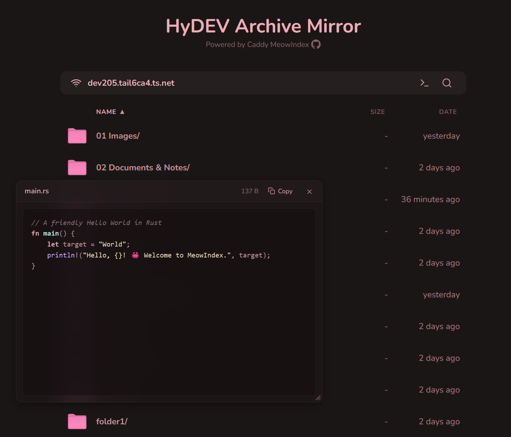

# MeowIndex

A cute, feature-rich file listing theme and module for **Caddy** and **Nginx**.



## Demo

* HyDEV ArchLinux Repo: https://arch.hydev.org/
* HyDEV Backup CDN: https://cdn.hydev.org/backup/

## Features

* [x] List files
* [x] Show file icons
* [x] Clickable, length-safe breadcrumb path
* [x] Quick Look previews (Space)
* [x] Search
* [x] Sort by name, size, or date
* [x] Streamlined wget helper
* [x] Relative timestamps and formatted sizes
* [x] Fix mobile view
* [x] Both Caddy and Nginx support

---

## Setup Guides

* 🚀 **[Caddy Setup Guide](docs/setup-caddy.md)** — Native SSR, zero build steps, drop-in template
* 🐧 **[Nginx Setup Guide](docs/setup-nginx.md)** — SolidJS SPA + autoindex JSON mode

---

## Shortcuts & Controls

| Action | How to Trigger | Description |
| :--- | :--- | :--- |
| **Search / Filter** | Press <kbd>Ctrl</kbd>+<kbd>F</kbd>, <kbd>Cmd</kbd>+<kbd>F</kbd>, <kbd>/</kbd>, or click 🔍 | Filter files in real-time. Press <kbd>Esc</kbd> to exit. |
| **Keyboard Nav** | <kbd>↓</kbd> / <kbd>↑</kbd> (or <kbd>j</kbd> / <kbd>k</kbd>) + <kbd>Enter</kbd> | Move focus highlight through files and press Enter to open. |
| **Column Sorting** | Click **Name**, **Size**, or **Date** header | Sort by filename, numeric byte size, or modification date. Folders stay pinned at the top. |
| **Quick Look** | Tap <kbd>Space</kbd> (pin) or Hold <kbd>Space</kbd> (scan) | Quick-tap Space to open a persistent, movable, and resizable preview window (close via <kbd>&times;</kbd>, <kbd>Esc</kbd>, or <kbd>Space</kbd>). Hold Space and move mouse or arrow keys to scan previews dynamically. |
| **Copy Wget Clone** | Click **`>_`** in the toolbar | Copies recursive `wget` command to clipboard with inline `✓ Copied` feedback. |
| **Inspect Wget** | <kbd>Shift</kbd> + Click **`>_`** | Toggles collapsible command drawer. |
| **Breadcrumbs** | Click any path segment | Jump up to parent directories. Auto-scrolls and supports mouse-wheel. |

---

## Development

If you want to modify or customize the Caddy template, the source code is modularized in `caddy/`:

```sh
npm run build:caddy   # Compile caddy/ source into docs/meowindex.html
npm run watch:caddy   # Live reload / watch mode
```
